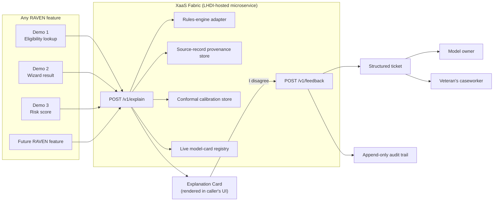

# Demo 4 Strategy — The Explainability-as-a-Service (XaaS) Fabric

**Status:** Proposed / spec'd for build. Not yet implemented — this document
and the "DEMO 4" section of
[CLAUDE_CODE_BUILD_BRIEF.md](../CLAUDE_CODE_BUILD_BRIEF.md) are the strategy
and spec; no `demo4-*` code exists in this repo yet.

## The one-liner

A first-class XaaS microservice on LHDI that any RAVEN feature can call.
Before a Veteran or caseworker ever sees a recommendation, the feature calls
one contract and gets back:

1. the eligibility rules matched,
2. the source records that triggered them,
3. a conformal confidence interval,
4. subgroup performance metrics (age, race, discharge status, geography)
   drawn from a live model-card database, and
5. an "I disagree" button that opens a structured feedback path back to the
   model owner and the Veteran's caseworker.

## Why this is Demo 4, not a fifth wheel

Demos 1–3 each prove one piece of trustworthy delivery in isolation. Demo 4's
job is to show that those pieces aren't three separate improvisations — they
are one reusable primitive that every future RAVEN feature inherits for
free, without re-litigating "how do we explain this recommendation" per
team, per sprint.

| Existing proof point | What it already proves | What XaaS generalizes it into |
| --- | --- | --- |
| Demo 1 — Lighthouse Under Load | RAVEN degrades gracefully and never fabricates data when Lighthouse is flaky | The FHIR resources behind a lookup become citable, replayable **source records** (item b) instead of a one-off event log |
| Demo 2 — 508-First Eligibility Wizard | `rulesEngine.ts` is a cited, deterministic decision table; AI explains, it never decides | The rules-vs-AI trust boundary becomes a **shared contract** every feature calls (item a), instead of a pattern each team has to remember to re-implement |
| Demo 3 — Vendor Rigor Console | Rigor is enforced by tooling — bots and Slack verifiers, not memory, with an append-only audit trail | The same "structured event → routed notification → audit trail" machinery becomes the **"I disagree" recourse path** (item e), reusing `AUDIT_TRAIL.md`-style logging instead of inventing a new one |

The pitch to the evaluator: *"We didn't just build three trustworthy
features. We built the plumbing so the fourth, fifth, and fiftieth RAVEN
feature are trustworthy by construction, not by discipline."*

## The compliance anchor this buys

Federal AI governance (OMB M-24-10 and the agency risk-management
expectations that follow from EO 14110) treats benefit-eligibility
determinations as textbook **rights-impacting AI use cases**, which carry
minimum practices such as: pre-deployment and ongoing testing for
performance and disparate impact, monitoring for degraded or biased
performance in production, providing affected individuals with notice and a
plain-language explanation, and giving them a route to human review and
remedy. This is directional context, not a compliance certification — but
it maps almost one-to-one onto the five XaaS deliverables:

| Minimum practice (paraphrased) | XaaS deliverable |
| --- | --- |
| Explain the basis for the decision | (a) rules matched, (b) source records |
| Test and monitor for disparate impact | (d) live subgroup performance metrics |
| Quantify uncertainty, don't overstate confidence | (c) conformal confidence interval |
| Give affected individuals a path to human review | (e) "I disagree" → model owner + caseworker |

That framing — "we operationalized the AI risk-management minimum
practices as infrastructure, not a policy memo" — is a strong, accurate
discriminator for a benefits-adjacent capture, and it's one the evaluator
can click through rather than take on faith.

## What it looks like live

The demo has two halves, mirroring how Demo 3's console works today:

1. **The Explanation Card** — the actual embeddable widget. Given a
   recommendation, it renders the five items above as one panel: matched
   rules with citations, a source-record trail back to the specific
   Patient/Clinical/Coverage resources, a shaded confidence band instead of
   a bare percentage, a subgroup fairness table pulled from the model-card
   registry, and a visible "I disagree" button.
2. **The Integration Simulator** — a control that lets the evaluator pick
   "call this from Demo 1's eligibility lookup," "call this from Demo 2's
   wizard result," or "call this from Demo 3's ship-checklist risk score,"
   and watch the same Explanation Card render against three different
   payload shapes from the same contract. This is the load-bearing proof:
   it demonstrates *reuse*, not three copy-pasted widgets.

## Architecture



## The contract (API sketch)

```
POST /v1/explain
{
  "recommendationId": "rec_8f21",
  "program": "HUD-VASH",
  "modelVersion": "hud-vash-eligibility@2026.3",
  "ruleTraceId": "rt_339a",
  "sourceRecordRefs": ["Patient/1013925208V123456", "Coverage/8823"]
}

→ 200
{
  "rulesMatched": [
    { "id": "hud-vash-1", "citation": "38 CFR § 63.4(a)(2)", "predicate": "...", "result": true }
  ],
  "sourceRecords": [
    { "system": "Coverage/v0", "resourceType": "Coverage", "resourceId": "8823",
      "retrievedAt": "2026-08-12T14:03:00Z", "fields": { "status": "active" } }
  ],
  "confidence": {
    "point": 0.82, "lower": 0.71, "upper": 0.91,
    "method": "split-conformal", "coverageTarget": 0.9,
    "calibrationSetSize": 4200, "calibrationAsOf": "2026-08-01"
  },
  "subgroupMetrics": [
    { "dimension": "age", "group": "65+", "n": 812, "accuracy": 0.88, "fpr": 0.05, "lastUpdated": "2026-08-01" },
    { "dimension": "race", "group": "Black/African American", "n": 340, "accuracy": 0.79, "fpr": 0.11, "lastUpdated": "2026-08-01" }
  ],
  "modelCard": { "id": "hud-vash-eligibility", "version": "2026.3", "owner": "raven-benefits-ml@va.gov", "lastValidated": "2026-08-01" },
  "disagreeEndpoint": "/v1/feedback"
}

POST /v1/feedback
{ "recommendationId": "rec_8f21", "veteranCaseId": "case_5521",
  "disagreeReason": "missing_context", "freeText": "Veteran's discharge status was upgraded last month.",
  "caseworkerId": "cw_204" }

→ 201
{ "ticketId": "fb_7710", "routedTo": ["raven-benefits-ml@va.gov", "cw_204"], "slaHours": 24 }
```

Every RAVEN feature codes against this one contract instead of building its
own confidence math, its own fairness query, or its own feedback form.

## Model-card registry — the "live" part

The subgroup metrics can't be a hardcoded table or the demo is exactly the
kind of prose claim it's trying to replace. The registry is a small,
versioned dataset (schema below) that the demo seeds with realistic,
clearly-labeled synthetic figures and that a production deployment would
populate from real model-monitoring output:

```sql
model_card(id, program, model_version, owner, last_validated, notes)
subgroup_metric(model_card_id, dimension, group_label, n, accuracy, fpr, fnr, as_of)
disagree_ticket(id, recommendation_id, veteran_case_id, reason, free_text,
                caseworker_id, routed_to, status, created_at)
```

`last_validated` and `as_of` are surfaced in the UI deliberately — a
subgroup metric with no freshness stamp is a claim, not evidence.

## Phased roadmap

| Phase | Scope | Effort |
| --- | --- | --- |
| **Phase 0 — this proposal** | Demo 4 built exactly as spec'd in the build brief: mocked/deterministic `xaas-service`, seeded model-card DB, Explanation Card + Integration Simulator calling it from Demo 1/2/3 payload shapes | ~2 weeks, matches Demo 1–3's build cadence |
| **Phase 1 — pilot (first 90 days post-award)** | Swap the mocked conformal calibration store for a real one against the pilot program's actual recommendation model; stand up a real ingestion job for subgroup metrics from production monitoring | Depends on pilot model availability |
| **Phase 2 — production, LHDI-hosted** | Multi-tenant XaaS with per-caller auth, versioned model cards, SLA-tracked disagree tickets wired into the real caseworker case-management system, and a governance review of the confidence/fairness thresholds that trigger escalation | Post-pilot, scoped with the government PO |

## Differentiation talking points

- *"Every RAVEN recommendation ships with its receipts."* Rules matched and
  source records aren't a debugging feature — they're what a Veteran's
  appeal or a caseworker's second-guess needs on day one.
- *"We quantify uncertainty instead of hiding it."* A conformal interval
  with a stated coverage target is a stronger, more honest claim than a bare
  confidence percentage — and it's the same rigor-by-tooling posture Demo 3
  already sold.
- *"Fairness monitoring is a live query, not a one-time audit slide."*
  Subgroup metrics carry a freshness timestamp and come from the same
  registry every feature reads, so there's one place to fix a fairness gap
  instead of five.
- *"Disagreement is a first-class outcome, not a dead end."* The button
  exists precisely because the model card admits it isn't perfect for every
  subgroup — and every click is audited exactly like Demo 3's other rigor
  events.

## Risks & mitigations

| Risk | Mitigation |
| --- | --- |
| Conformal intervals require a calibration set; a demo has no real production traffic | Seed a synthetic but methodologically real split-conformal calibration set (documented in `docs/scenes/`), exactly as Demo 1 documents its simulated Lighthouse client — the math is real, the data is synthetic and labeled as such |
| Subgroup metrics on synthetic data risk looking like a fabricated fairness claim | Every metric row is timestamped and the seed dataset ships with a `KNOWN_SIMPLIFICATIONS` note, matching the existing `Known simplifications` sections in Demo 1/2's docs |
| "I disagree" needs somewhere real to route to; no live caseworker CRM exists in this environment | Route to a mock ticket queue with the same structured audit-trail pattern Demo 3 already uses for `AUDIT_TRAIL.md`, swappable for the real case-management integration in Phase 1 |
| Scope creep — this could become "build a real ML platform" | Phase 0 is explicitly the contract + demo harness, not a production inference pipeline; the build-brief section below caps it at that |

## Requirements traceability

| XaaS deliverable | Codified in | Enforced/shown by |
| --- | --- | --- |
| (a) Eligibility rules matched | `RulesMatchedPanel.tsx`, rules-engine adapter | Explanation Card, citations same style as Demo 2's `rulesEngine.ts` |
| (b) Source records that triggered them | `SourceRecordTrail.tsx`, provenance store | Explanation Card, resource refs same shape as Demo 1's FHIR client |
| (c) Conformal confidence interval | `ConfidenceBand.tsx`, `conformal.ts` | Explanation Card, shaded interval with stated coverage target |
| (d) Subgroup performance metrics (live model-card DB) | `SubgroupFairnessPanel.tsx`, `model-card-db/` | Explanation Card, timestamped per-dimension table |
| (e) "I disagree" → model owner + caseworker | `DisagreeModal.tsx`, `feedback.ts`, `docs/FEEDBACK_ROUTING.md` | Structured ticket, audit trail, SLA clock |

## What's explicitly out of scope for the demo

- A real production inference or ML-training pipeline.
- A live integration with an actual VA caseworker case-management system —
  Phase 0 mocks the destination, Phase 1 plans the real integration.
- Multi-tenant auth/rate-limiting for the microservice itself — Phase 2.

This mirrors how Demo 1 and Demo 2 already scope out real
`sandbox-api.va.gov` OAuth and a CI pipeline: say precisely what's simulated
and why, so nothing here reads as an unverifiable claim.
